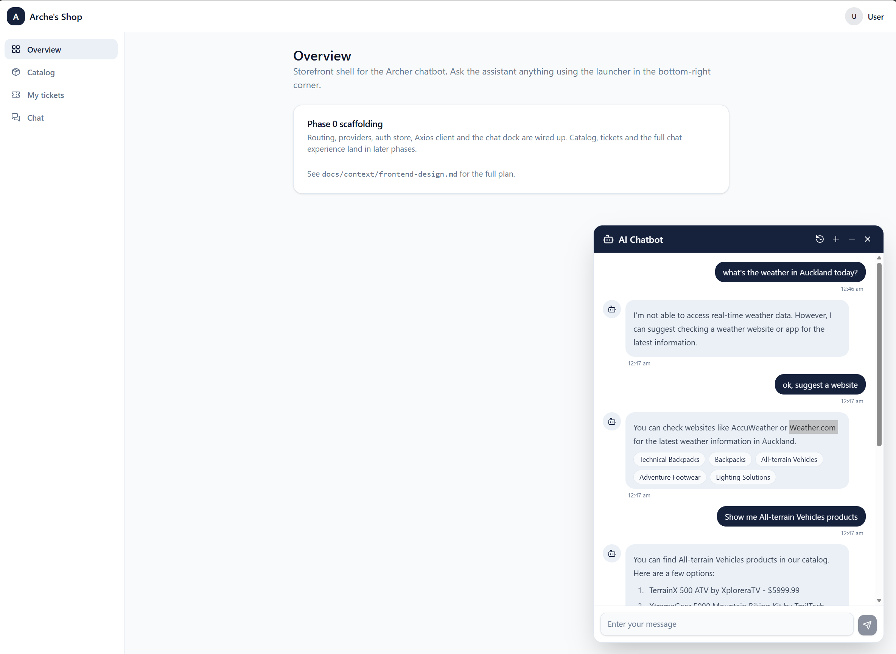

# Archer Chatbot

A full-stack e-shop assistant: a **React chat UI** backed by a **.NET 10 + Aspire** service that
answers general questions and business-data questions (products, categories, and product manuals via
RAG) using an LLM — Ollama locally by default, or OpenAI. 



## Projects

| Project | Role |
| --- | --- |
| `src/WebUI` | React 19 + Vite chat frontend (docked chatbot, server-backed history, product/citation cards) |
| `src/Backend` | Minimal API: chat + conversation endpoints, catalog, tickets, semantic search |
| `src/ServiceDefaults` | Shared Aspire wiring: telemetry, service discovery, chat-client setup |
| `src/AppHost` | .NET Aspire orchestration (Postgres, Qdrant, Redis, Blob storage, Ollama, Python inference) |
| `src/IdentityServer` | Duende IdentityServer issuing the JWTs the Backend requires |
| `src/PythonInference` | FastAPI + transformers local inference service |

Storage: PostgreSQL (relational), Qdrant (vector), Azure Blob (documents), Redis (pub/sub).

## Documentation

- [Backend API — auth, endpoints, workflows](docs/postman/API.md) (+ importable
  [Postman collection](docs/postman/archer_chatbot.postman_collection.json))
- [Frontend design & phased plan](docs/context/frontend-design.md)
- [Security policy](SECURITY.md) · [Code of conduct](CODE_OF_CONDUCT.md)

## Getting started

### Prerequisites

- [.NET 10 SDK](https://dot.net/download) (Aspire 13 ships as NuGet packages — no workload install needed)
- [Docker Desktop](https://docs.docker.com/engine/install/), running (hosts Postgres, Qdrant, Redis, Azurite, Ollama)
- [Node.js 20+](https://nodejs.org/) for the React frontend
- [Python 3.12](https://www.python.org/downloads/) for the local inference service (wheels require 3.11–3.12, **not** 3.13)
- (Optional) An Nvidia GPU for Ollama — uncomment `.WithGPUSupport()` in `src/AppHost/Program.cs`

### 1. Create the Python inference venv

Aspire launches `src/PythonInference/.venv` automatically when it exists:

```powershell
py -3.12 -m venv src/PythonInference/.venv
src/PythonInference/.venv/Scripts/python -m pip install -r src/PythonInference/requirements.txt
```

### 2. Run the backend stack (Aspire)

> [!WARNING]
> Make sure Docker is running first.

```powershell
dotnet run --project src/AppHost
```

Watch the console for the Aspire dashboard URL (`Login to the dashboard at: http://localhost:17191/login?t=…`).
Or open `eShopSupport.slnx` in Visual Studio / Rider and run the `AppHost` project.

### 3. Run the frontend

```powershell
cd src/WebUI
npm install
npm run dev
```

Open http://localhost:5173, sign in, then chat via the launcher in the bottom-right. Seeded test
users: **bob / bob** (staff) and **alice / alice** (customer). Defaults assume the Backend on `:5165`
and IdentityServer on `:7275`; override with a `.env` (`VITE_API_TARGET`, `VITE_OIDC_AUTHORITY`).

## Sample data

Pre-chunked, pre-embedded fictional business data in `seeddata/dev` (products, categories, customers,
tickets, and manual chunks) is imported into PostgreSQL and Qdrant on Backend startup. Manual search
runs on the embedded chunks in `manual-chunks.json`.
