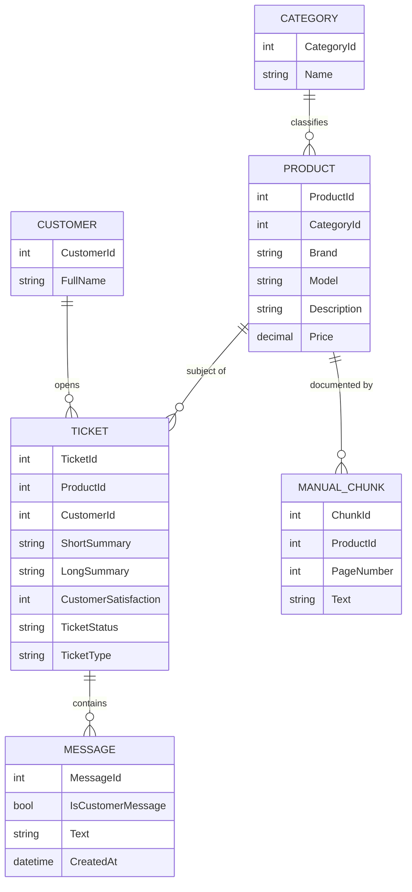
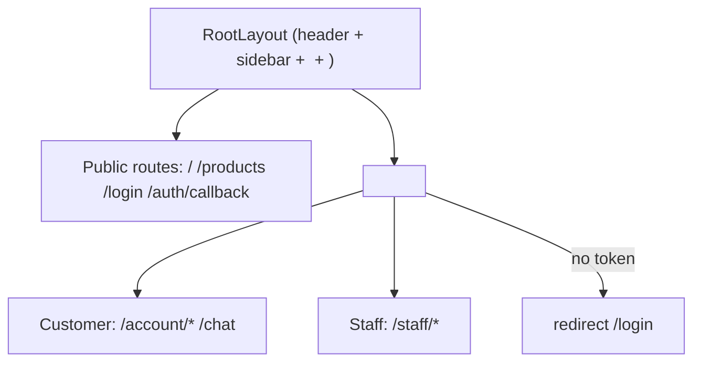
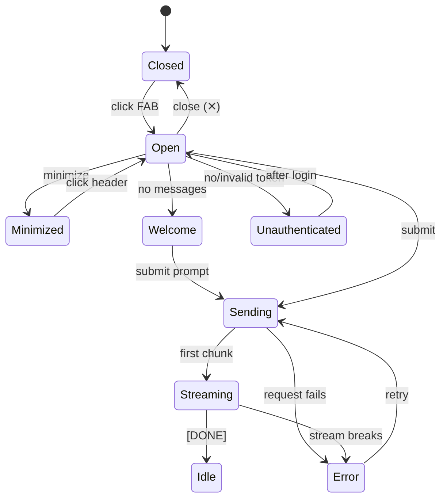
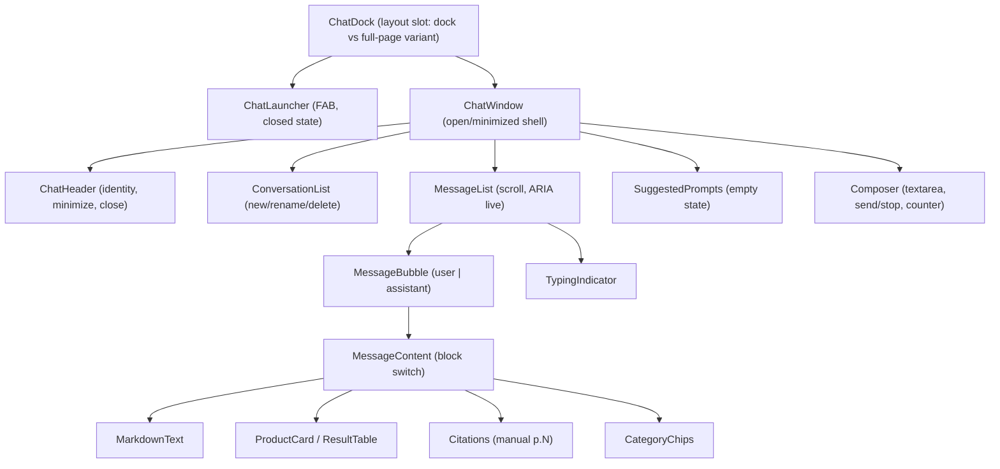
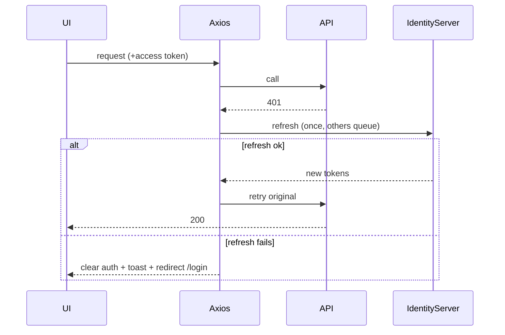

# Frontend Design — Archer Chatbot (React)

> **Status:** Planning only. No implementation code. Awaiting review.
> **Date:** 2026-09-19
> **Scope:** React 19 + Vite frontend for an e-shop business chatbot that answers (1) general
> questions via the LLM and (2) business-data questions from the seeded e-shop data.

---

## Step 1 — Inputs I read before designing

### 1a. Seed data (`seeddata/dev/*.json`)

All files are **arrays of records**. Every entity carries a pre-computed embedding field, which
tells us the backend does semantic search server-side — the frontend never touches embeddings.

| File | Count | Record shape (fields) | Notes / relationships |
| --- | --- | --- | --- |
| `categories.json` | 67 | `CategoryId`, `Name`, `NameEmbeddingBase64` | Product taxonomy. `Name` e.g. *Solar Power, Action Cameras, Hydration Systems, GPS Navigation*. Outdoor/adventure retail domain. |
| `products.json` | 200 | `ProductId`, `CategoryId → categories`, `Brand`, `Model`, `Description`, `Price`, `NameEmbedding` | 140 brands, price **14.99 – 5999.99**. Display name pattern is **`"Model (Brand)"`** (matches `CreateTicketRequest.productName`). |
| `customers.json` | 383 | `CustomerId`, `FullName` | Minimal — just identity. No email/address in seed. |
| `tickets.json` | 500 | `TicketId`, `ProductId → products`, `CustomerId → customers`, `CreatedAt`, `ShortSummary`, `LongSummary`, `CustomerSatisfaction` (1–10, **nullable**), `TicketStatus` (`Open`/`Closed`), `TicketType` (`Question`/`Idea`/`Complaint`/`Returns`), `Messages[]` | Support tickets. |
| ↳ `Messages[]` item | — | `MessageId`, `CreatedAt`, `TicketId`, `IsCustomerMessage` (bool), `Text` | Threaded conversation between a customer and staff. |
| `manual-chunks.json` | ~15 MB | `ChunkId`, `ProductId → products`, `PageNumber`, `Text`, `Embedding` | Product-manual text, pre-chunked + embedded. This is the **RAG knowledge base** the assistant searches. |

**Entity relationship (seed data):**



**Key implication for the chatbot:** "business data" = **products** (catalog/search), **categories**,
and **product manuals** (RAG). Tickets/customers are staff-side support data. The bot's business
answers will mostly be *product discovery* + *manual/how-to* questions.

### 1b. Backend API (`docs/postman/API.md`)

- **Auth:** all endpoints protected by JWT from a separate **IdentityServer**. Two policies:
  - `StaffApi` (default fallback) — JWT with `role=staff`. Covers `/tickets*`, `/api/ticket*`,
    `/api/assistant/*`, `/manual`, `/api/categories`, `/api/products`.
  - `CustomerApi` — any authenticated non-staff user with numeric `sub` = customer id. Covers
    `/customer/*`, `/api/customer/*`.
- **Token acquisition:** staff via **client-credentials** (`dev-and-test-tools`); customer via
  interactive **OIDC auth-code** (`customer-webui`, e.g. alice `sub=10000`).
- **Enums serialize as integers**: `TicketStatus {Open=0,Closed=1}`, `TicketType
  {Question=0,Idea=1,Complaint=2,Returns=3}`.

| # | Method | Path | Policy | Body | Response (shape) |
| --- | --- | --- | --- | --- | --- |
| 1 | POST | `/tickets` | Staff | `ListTicketsRequest` | `{ items[], totalCount, totalOpenCount, totalClosedCount }` |
| 2 | GET | `/tickets/{id}` | Staff | – | Ticket detail incl. `messages[]` (404 if missing) |
| 3 | PUT | `/api/ticket/{id}` | Staff | `UpdateTicketDetailsRequest` | 200; publishes Redis `ticket:{id}` event |
| 4 | POST | `/api/ticket/{id}/message` | Staff | `SendTicketMessageRequest` | 200; appends staff reply |
| 5 | POST | `/api/assistant/chat` | Staff | `AssistantChatRequest` | **Streaming** NDJSON-ish array (see below) |
| 6 | GET | `/manual?file={name}` | Staff | – | PDF bytes (404 if missing) |
| 7 | GET | `/api/categories?searchText=` or `?ids=1,2` | Staff | – | `[{ categoryId, name }]` |
| 8 | GET | `/api/products?searchText=` | Staff | – | `[{ productId, brand, model }]` |
| 9 | GET | `/customer/tickets` | Customer | – | Caller's own tickets |
| 10 | GET | `/customer/tickets/{id}` | Customer | – | One own ticket (404 if not theirs) |
| 11 | POST | `/customer/tickets/create` | Customer | `CreateTicketRequest` | Opens ticket; type auto-classified by Python model |
| 12 | POST | `/api/customer/ticket/{id}/message` | Customer | `SendTicketMessageRequest` | 200 |
| 13 | PUT | `/api/customer/ticket/{id}/close` | Customer | – | 200 |
| 14 | GET | `/api/customer/products?searchText=` | Customer | – | Storefront product search |

**Assistant streaming format (endpoint #5):** opens with `[null`, then appends `,\n<item>`
chunks, closes with `]`. Each `<item>` is an `AssistantChatReplyItem` with a `type`:
`AnswerChunk=0`, `Search=1`, `SearchResult=2`, `IsAddressedToCustomer=3`. It is **not valid JSON
until the final `]`** — must be parsed incrementally. Requires Ollama running + seeded manuals.

> ⚠️ **Critical finding:** `/api/assistant/chat` is the *only* AI endpoint, and it is a
> **staff-facing, ticket-scoped co-pilot** — its request requires `productId`, `customerName`,
> `ticketSummary`, and `ticketLastCustomerMessage`. There is **no general-purpose, customer-facing
> conversational chatbot endpoint**, and **no conversation persistence** of any kind. This is the
> central gap driving Section D.

### 1c. UI reference image

Carried-over layout elements from the attached dashboard mock:

- **Dark left icon rail** — workspace/bot switcher (stacked avatars + "＋ add").
- **Light secondary sidebar** — primary nav (Overview, Chat history, Leads, Links, Text, Q&A,
  Tune AI, Appearance, Deploy, Integrations, Settings) + a plan/upsell card pinned bottom.
- **Central content grid** — stat cards (Training usage, Messages, Leads chart, geo map).
- **Right-docked chat panel** — **the chatbot**: dark header with bot identity + close (✕),
  alternating **assistant (left, light) / user (right, dark)** bubbles, a **typing indicator**
  (three dots), a date/time separator chip, and a rounded **input with a send button**.

The image frames the chatbot as a **docked side panel** with clear bubble styling, a typing state,
and a persistent composer — this drives the entry-point recommendation in Section B.

---

## Step 2 — Design

## A. E-shop shell (frame only)

The shell is intentionally thin — this project's focus is the chatbot. Storefront/catalog pages
are placeholders.

```
┌───────────────────────────────────────────────────────────────┐
│ Header: logo · global search · cart · account menu · [Chat ◗]  │
├──────────┬────────────────────────────────────────────────────┤
│ Sidebar  │  Main content (routed <Outlet/>)                    │
│ (nav /   │                                                     │
│ catalog  │                                                     │
│ filters) │                        ┌───────────────────────────┐│
│          │                        │  Chatbot panel (docked,   ││
│          │                        │  overlays right edge;     ││
│          │                        │  floating launcher when   ││
│          │                        │  closed)                  ││
└──────────┴────────────────────────┴───────────────────────────┘
```

- **Header** — brand, product search, cart, account/auth menu, and the **chat launcher toggle**.
- **Sidebar** — catalog nav placeholder (categories from `/api/categories`).
- **Main** — routed pages via a single `<Outlet/>`.
- **Chatbot** — lives in a **persistent layout slot** (rendered once at the layout level so it
  survives route changes and keeps its open/minimized state).

### Route map (React Router v7)

| Route | Access | Purpose |
| --- | --- | --- |
| `/` | Public | Home / storefront landing (placeholder) |
| `/products` | Public | Catalog list (placeholder, backed by product search) |
| `/products/:productId` | Public | Product detail (placeholder) |
| `/login` | Public | Sign-in (redirect to IdentityServer / OIDC) |
| `/auth/callback` | Public | OIDC redirect handler |
| `/account` | **Auth** | Account overview (placeholder) |
| `/account/tickets` | **Auth (customer)** | Customer's own tickets (`/customer/tickets`) |
| `/account/tickets/:id` | **Auth (customer)** | Ticket thread |
| `/chat` | **Auth** | Full-page chat fallback (mobile / deep-link to a conversation) |
| `/staff` | **Auth (staff)** | Staff console shell (placeholder) |
| `*` | Public | 404 |

- **Public:** `/`, `/products*`, `/login`, `/auth/callback`, `404`.
- **Authenticated:** everything else, gated by a `<ProtectedRoute>` wrapper reading auth state
  from Zustand; **role-aware** (`customer` vs `staff`) for `/account/*` vs `/staff/*`.



---

## B. Chatbot window — **primary focus**

### B1. Entry point — recommendation

**Recommended: a right-docked collapsible side panel with a floating launcher button (FAB), plus a
full-page `/chat` route as the mobile/expanded fallback.**

Reasoning:
- The **reference image shows exactly this** — a chat panel docked to the right edge with a bot
  header and close button, sitting alongside dashboard content. It is not a full page and not a
  tiny bubble-only popover.
- A **docked panel** lets the user keep browsing the catalog while chatting (business-data queries
  like "show me waterproof jackets" pair naturally with the storefront behind it).
- A **FAB** is the lowest-friction closed state and is the industry-standard affordance.
- **Full-page `/chat`** covers mobile (where a side panel is impractical) and deep links to a
  specific conversation. One shared component tree renders in both a `Sheet` (desktop dock) and a
  full-height page (mobile) — driven by a `variant` prop, not duplicated.

Rejected alternatives: *full page only* (loses "chat while shopping"); *bubble popover only* (too
small for product cards/tables); *modal dialog* (blocks the page, fights the "browse + chat" flow).

### B2. States



| State | UI |
| --- | --- |
| **Closed** | FAB only (bot avatar, unread dot). |
| **Open** | Header (bot identity, minimize, close) + message list + composer. |
| **Minimized** | Collapsed header bar; click to restore; preserves scroll + draft. |
| **Empty / Welcome** | Greeting ("Hi! I'm the AI bot…") + **suggested prompts** (B4). |
| **Loading / typing** | Three-dot typing indicator bubble (as in image) while awaiting first token. |
| **Streaming** | Assistant bubble grows token-by-token; **Send** becomes **Stop**; auto-scroll unless user scrolled up. |
| **Error** | Inline error bubble + **Retry**; Sonner toast for transient/network errors. |
| **Unauthenticated** | Composer disabled with a "Sign in to chat" CTA → `/login`; welcome text still visible. |

### B3. Message rendering

- **User bubble** — right-aligned, dark (per image), plain text (no markdown execution for user).
- **Assistant bubble** — left-aligned, light, **rendered markdown** (sanitized): headings, lists,
  links, inline code, tables.
- **Structured business-data results** — the key differentiator. The assistant reply can carry
  *typed payloads*; render them as **rich cards, not raw text**:

  | Payload kind | Rendered as | Source data |
  | --- | --- | --- |
  | Product match(es) | **Product card(s)** — brand, model, price, category, "View" link | products |
  | Product list / comparison | **Compact table** (Brand · Model · Price) | products |
  | Manual / how-to answer | Markdown answer + **"From the manual (p.N)" citation chips** | manual-chunks |
  | Category suggestions | **Chips** that re-query on click | categories |
  | Ticket/order summary (staff) | **Summary card** (status, type, satisfaction) | tickets |
  | Plain LLM answer | Markdown text bubble | LLM |

- **Rendering strategy:** each assistant message is a list of **content blocks** discriminated by
  `kind` (`"text" | "products" | "table" | "citations" | "categories" | "ticket"`). A
  `<MessageContent>` switch maps block → component. A plain LLM answer is just a single `text`
  block, so general vs. business answers share one pipeline.
- **Streaming mapping:** the backend's `AssistantChatReplyItem` types map to blocks:
  `AnswerChunk` → append to current `text` block; `Search` → transient "Searching…" affordance;
  `SearchResult` → a `products`/`citations` block; `IsAddressedToCustomer` → metadata flag
  (staff co-pilot only). *(Section D proposes a cleaner customer-facing contract.)*

### B4. Suggested prompts / quick actions (seed-data driven)

Derived from the outdoor-retail seed so they actually return results:
- *"What solar power products do you have under $200?"* (products + price filter)
- *"Compare your GPS trackers."* (product table)
- *"How do I clean my waterproof jacket?"* (manual RAG)
- *"Recommend a hydration system for a day hike."* (category → products)
- *"What's your return policy?"* (general LLM)

Rendered as chips in the Welcome state and as a collapsible "＋" menu in the composer.

### B5. Conversation history

Mirrors the image's **"Chat history"** nav item.
- **New chat** — clears active thread, returns to Welcome.
- **List of past chats** — title (auto from first message), last-message preview, timestamp.
- **Rename / delete** — per-item overflow menu (Radix dropdown), delete confirmed via `AlertDialog`.
- **Persistence caveat:** the backend has **no conversation store today** (Section D). Until those
  endpoints exist, Phase 1 keeps history **client-side** (Zustand-persisted) as a documented
  interim, swapped for server-backed history in Phase 3.

### B6. Input / composer

- **Multiline** auto-grow textarea; **Enter** = send, **Shift+Enter** = newline.
- **Send / Stop** toggle — Stop aborts the in-flight stream (AbortController).
- **Character limit** — soft counter (e.g. 2000) with a color warning nearing the cap; block send
  when over.
- **Disabled states** — while streaming (except Stop), when unauthenticated, when offline.
- **Draft preservation** across minimize/route changes (Zustand UI state).

### B7. Responsive & accessibility

- **Desktop (≥1024px):** docked `Sheet`/side panel (~420px), overlays right edge.
- **Tablet:** narrower dock or slide-over.
- **Mobile (<768px):** FAB opens the **full-page `/chat`** route (full-height, no dock).
- **Accessibility:**
  - Keyboard: FAB and composer fully reachable; **focus moves into the panel on open** and
    **returns to the FAB on close** (focus trap while open).
  - **ARIA live region** (`aria-live="polite"`) wrapping the message list so new/streamed
    assistant text is announced without stealing focus.
  - Roles/labels on send/stop/minimize/close; visible focus rings; respects
    `prefers-reduced-motion` for the typing animation; contrast-checked bubbles.

---

## C. Frontend architecture

### C1. Folder structure (feature-based)

```
src/
├─ app/                      # app bootstrap
│  ├─ router.tsx             # React Router v7 route tree
│  ├─ providers.tsx         # QueryClient, Tooltip, Sonner <Toaster/>
│  └─ query-client.ts
├─ components/ui/            # shadcn/ui primitives (button, sheet, dialog, ...)
├─ lib/
│  ├─ axios.ts              # axios instance + interceptors
│  ├─ sse.ts                # streaming reader (fetch + ReadableStream)
│  └─ utils.ts
├─ features/
│  ├─ auth/                 # login, OIDC callback, ProtectedRoute, useAuth
│  ├─ chat/                 # ⭐ the chatbot
│  │  ├─ components/        # ChatDock, ChatWindow, MessageList, MessageBubble,
│  │  │                     # MessageContent, ProductCard, ResultTable, Citations,
│  │  │                     # Composer, SuggestedPrompts, TypingIndicator,
│  │  │                     # ConversationList, ChatLauncher
│  │  ├─ hooks/             # useConversations, useMessages, useSendMessage,
│  │  │                     # useChatStream
│  │  ├─ api/               # chat API fns (typed)
│  │  ├─ store/             # chat UI store (zustand)
│  │  └─ schemas/           # zod schemas for chat DTOs
│  ├─ catalog/              # product/category placeholders
│  └─ tickets/              # customer ticket views
├─ stores/                  # cross-feature zustand (auth, ui)
├─ schemas/                 # shared zod schemas
└─ types/                   # shared TS types
```

### C2. Chatbot component tree



| Component | Responsibility |
| --- | --- |
| `ChatDock` | Chooses dock (Sheet) vs full-page by breakpoint; owns open/minimized via store. |
| `ChatLauncher` | FAB + unread indicator. |
| `ChatWindow` | Layout shell; wires header/list/composer; focus management. |
| `ChatHeader` | Bot identity, minimize, close. |
| `ConversationList` | List/select/new/rename/delete conversations. |
| `MessageList` | Virtualizable scroll, auto-scroll, ARIA live region. |
| `MessageBubble` | Alignment/styling by role; timestamp. |
| `MessageContent` | Discriminated-union block renderer (text/products/table/citations/categories). |
| `ProductCard`/`ResultTable`/`Citations`/`CategoryChips` | Structured business-data renderers. |
| `TypingIndicator` | Three-dot loading (matches image). |
| `SuggestedPrompts` | Seed-driven quick actions. |
| `Composer` | Input, send/stop, counter, disabled states, draft. |

### C3. State split

| Concern | Tool | Notes |
| --- | --- | --- |
| Conversations list, messages, product/category search | **TanStack Query** | Server state; caching, retries, pagination, invalidation. |
| Streaming assistant response | TanStack Query mutation **+** manual stream store | Mutation kicks off; tokens appended to a query-cache entry or local buffer (C5). |
| Auth tokens (access/refresh), current user + role | **Zustand (persisted)** | Persisted to storage; hydrated on load; single source for interceptors + guards. |
| UI: panel open/minimized, active conversation id, draft, variant | **Zustand (persisted for UI prefs)** | Draft + open state survive route changes/minimize. |
| Forms (composer, any settings) | **React Hook Form + Zod** | `zodResolver`. |

> **Security note:** persisting refresh tokens in `localStorage` is XSS-exposed. Flag as an **Open
> Question** — prefer httpOnly refresh cookie from IdentityServer if the flow allows; otherwise
> persist access token in memory + refresh via cookie. Documented, not silently chosen.

### C4. Axios setup (JWT + auto-refresh)

- **Instance** with `baseURL` (resolved from env / Aspire), `withCredentials` if cookie-refresh.
- **Request interceptor:** attach `Authorization: Bearer <accessToken>` from the auth store
  (skip for public + IdentityServer token calls).
- **Response interceptor:** on **401**, attempt a **single refresh**, queue concurrent 401s behind
  one in-flight refresh (shared promise), then replay. On refresh success → retry original.
- **Refresh fails mid-chat:** abort any active stream, clear auth store, show a Sonner error
  ("Session expired — please sign in"), and **redirect to `/login` preserving `returnTo`**. The
  chat panel drops to the **Unauthenticated** state with the draft preserved so the user can resume
  after re-login.



### C5. Streaming consumption

- **Transport:** the assistant endpoint streams a **custom chunked array over HTTP** (not true
  SSE), so use the **`fetch` + `ReadableStream` reader** (with `AbortController` for Stop/refresh),
  **not** `EventSource` (can't send auth headers / POST body) and **not** axios (no stream reader in
  browsers). A small `lib/sse.ts` incrementally parses the `[null ,item ,item ]` framing into typed
  `AssistantChatReplyItem`s.
- **Fit with TanStack Query:**
  - `useSendMessage` is a **mutation** that (a) optimistically appends the user message, (b) opens
    the stream, (c) appends parsed chunks to the active conversation's message in the query cache
    (or a local buffer surfaced by `useChatStream`), (d) on `[DONE]` writes the final message and
    **invalidates** the conversation/messages queries.
  - Conversation list & history stay pure Query reads.
- **Interim (Phase 1)** until a customer endpoint exists: proposed `POST /api/chat` returning
  **SSE** (Section D) — cleaner than the current bespoke framing; the reader abstraction hides which
  one is in use.

### C6. Zod schemas

- **API responses (validate at the boundary):** `Product`, `Category`, `TicketSummary`, `Ticket`,
  `Message`, `TokenResponse`, and — once defined — `Conversation`, `ChatMessage`, and the
  **discriminated union** `AssistantContentBlock` (`text | products | table | citations |
  categories`).
- **Streaming items:** `AssistantChatReplyItem` (discriminated by numeric `type`).
- **Forms:** `composerSchema` (non-empty, ≤ max chars), `renameConversationSchema`,
  `createTicketSchema` (`productName` matching `"Model (Brand)"`, message length).
- **Enum coercion:** map integer enums → string literals (`TicketStatus`, `TicketType`) in the
  schema transform so the UI works with readable values.

### C7. Error handling & Sonner

| Situation | Handling |
| --- | --- |
| Validation (form/response parse) | Inline field errors (RHF) + a dev-time console for schema mismatches. |
| 401 → refresh fail | Toast + redirect (C4). |
| 403 (wrong role) | Toast "You don't have access", no redirect loop. |
| 404 (ticket/product) | Inline empty/not-found state. |
| 429 / 5xx | Toast with retry; exponential backoff on idempotent GETs via Query. |
| Stream broken | Inline error bubble + Retry; toast if network-level. |
| Offline | Global banner + disabled composer. |

Sonner `<Toaster/>` mounted once in `providers.tsx`; a thin `notify` helper standardizes
success/error/info variants.

---

## D. Backend gap analysis

The UI needs a **customer-facing, persistent, general+business conversational** API. The backend
currently offers only a **staff, ticket-scoped, stateless** assistant. Gaps are significant.

| Needed capability | Existing endpoint | Status | Proposed endpoint + shape |
| --- | --- | --- | --- |
| Send chat message (general + business) | `POST /api/assistant/chat` (staff, ticket-scoped, needs productId/customerName/summary) | **Partial** | `POST /api/chat` → `{ conversationId?, message }`; returns `{ conversationId, messageId }` then streams (below). Customer-authable. |
| Streaming responses | `/api/assistant/chat` custom `[null,…]` framing | **Partial** | Standardize on **SSE** `text/event-stream`: events `token`, `block` (structured product/citation payload), `done`, `error`. |
| Create conversation | — | **Missing** | `POST /api/conversations` → `{ id, title, createdAt }` (or implicit-create on first message). |
| List conversations | — | **Missing** | `GET /api/conversations?cursor=&limit=` → `{ items:[{id,title,updatedAt,preview}], nextCursor }`. |
| Get conversation + messages | — | **Missing** | `GET /api/conversations/{id}` → `{ id, title, messages:[{id,role,blocks[],createdAt}] }`. |
| Rename conversation | — | **Missing** | `PATCH /api/conversations/{id}` `{ title }`. |
| Delete conversation | — | **Missing** | `DELETE /api/conversations/{id}` → 204. |
| Message history pagination | — | **Missing** | `GET /api/conversations/{id}/messages?cursor=&limit=` (cursor-based). |
| Cancel generation | HTTP abort only (no server ack) | **Partial** | Client `AbortController` (works now); optional `POST /api/chat/{messageId}/cancel` for server-side stop + token accounting. |
| Suggested prompts | — | **Missing** | `GET /api/chat/suggestions` → `[{ id, label, prompt }]` (seed/catalog-derived); or hardcode client-side interim. |
| Feedback (👍/👎) | — | **Missing** | `POST /api/messages/{id}/feedback` `{ rating: 1 \| -1, reason? }` → 204. |
| Auth refresh | IdentityServer token/refresh | **Exists** | Reuse OIDC refresh; confirm refresh-token/cookie strategy (C3 note). |
| Product search (business data) | `GET /api/products` (staff), `GET /api/customer/products` (customer) | **Exists** | Use **customer** variant for storefront chat; ensure it returns price/category for cards. |
| Category search | `GET /api/categories` (staff only) | **Partial** | Add a **customer-accessible** category read, or expand `/api/customer/products` filters. |
| Manual/RAG citations | manual-chunks searched *inside* assistant | **Partial** | Surface citations in the SSE `block` payload `{ productId, page, snippet }` so the UI can render chips. |
| Intent routing (general vs business) | Python model classifies **ticket type**, not chat intent; assistant does internal Search | **Partial/unclear** | Decide **server-side** intent+RAG orchestration inside `POST /api/chat`; frontend stays intent-agnostic and just renders returned blocks. |

**Summary:** to ship the chatbot as shown, the backend needs a **new customer-facing `/api/chat`
family** (send + SSE stream), **conversation persistence** (CRUD + pagination), and small additions
(suggestions, feedback, customer category access, citation payloads). The frontend is designed to
degrade gracefully (client-side history + hardcoded suggestions) until these land.

---

## Open Questions

1. **Who is the chatbot for?** The image looks like a customer storefront assistant, but the only
   AI endpoint is **staff-only and ticket-scoped**. Is Phase 1 customer-facing, staff-facing, or
   both? This changes auth policy and endpoint design.
2. **Conversation persistence** — is there any store today, or is all history to be built new
   (Section D)? Interim client-side history acceptable?
3. **Streaming contract** — may we replace the bespoke `[null,…]` framing with **SSE**, or must the
   frontend consume the existing format for now?
4. **Intent routing** — should "general vs business data" be decided **server-side** (recommended)
   or does the frontend need to hint intent?
5. **Structured payloads** — will the backend return typed blocks (product/citation), or only
   markdown text the frontend must parse? Strongly prefer typed blocks.
6. **Customer catalog access** — categories are staff-only; confirm a customer-safe category/product
   read for chat cards.
7. **Token storage** — is an httpOnly refresh cookie available from IdentityServer, or must we
   persist refresh tokens in the SPA (XSS risk)?
8. **Customer OIDC in an SPA** — auth-code + PKCE via `customer-webui`? Confirm redirect URIs and
   whether a lib (e.g. `oidc-client-ts`) is acceptable.
9. **Manuals** — `/manual` returns **PDF** (staff). Does chat cite PDF pages, or only manual-chunk
   text snippets?
10. **Product images** — none in seed data. Product cards will be text-only unless an image
    source is added.

---

## Phased implementation plan

**Phase 0 — Scaffolding**
Vite + React 19 + TS; Tailwind v4 (`@tailwindcss/vite`); shadcn/ui init; React Router v7 shell
(layout + public/protected routes); TanStack Query + Zustand providers; Axios instance; Sonner;
Zod base schemas. No chat logic yet.

**Phase 1 — Chatbot MVP (client-orchestrated)**
Docked panel + FAB + full-page `/chat`; states (closed/open/minimized/welcome/typing/error);
markdown assistant bubbles + user bubbles; composer (multiline, send/stop, counter); **hardcoded
seed-driven suggested prompts**; **client-side (Zustand-persisted) conversation history**; consume
the **existing** assistant stream (or a stub) via the fetch-stream reader. Auth: login + JWT attach
+ auto-refresh interceptor.

**Phase 2 — Structured business data**
`MessageContent` block renderer; **ProductCard / ResultTable / Citations / CategoryChips**; wire
product/category search; render manual citations; full a11y pass (focus trap, ARIA live, keyboard);
responsive polish.

**Phase 3 — Server-backed conversations (after Section D endpoints land)**
Swap client history for `/api/conversations` CRUD + cursor pagination; migrate to standardized
**SSE**; server-side cancel; **feedback 👍/👎**; suggestions endpoint. Optimistic updates +
invalidation.

**Phase 4 — Hardening**
Error/empty/offline states; retries/backoff; token-storage hardening; performance (message
virtualization, code-split chat feature); tests (schema, interceptor, stream parser, key flows);
analytics hooks if needed.

---

*End of plan. Awaiting your review before any implementation.*
