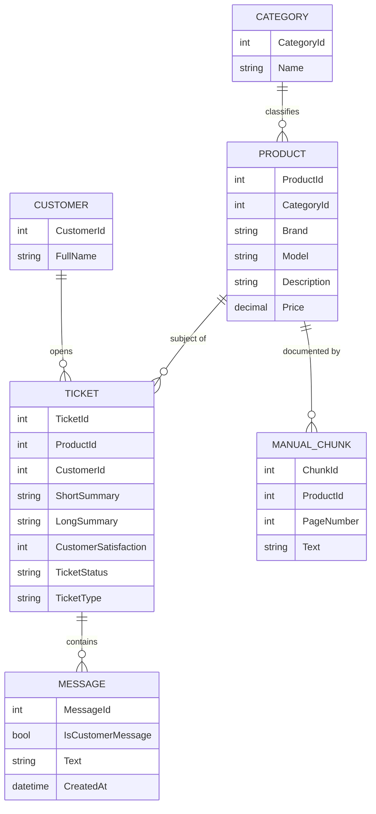
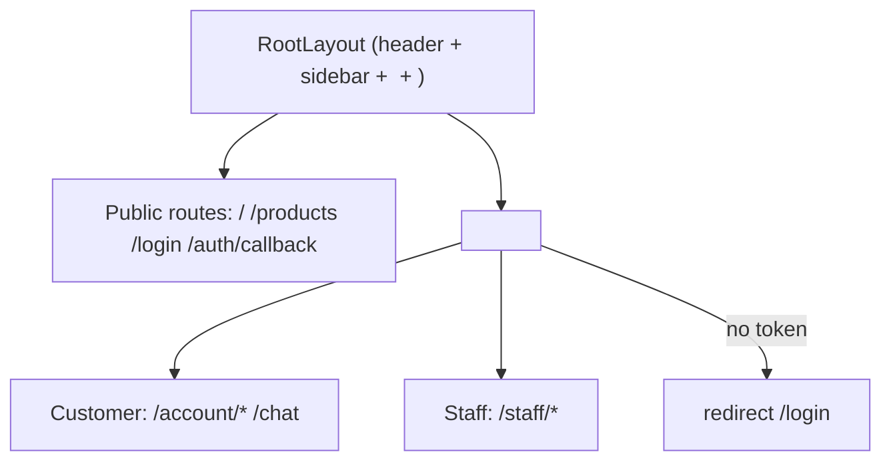
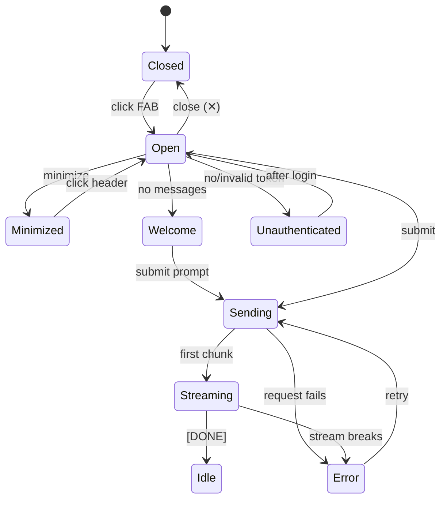
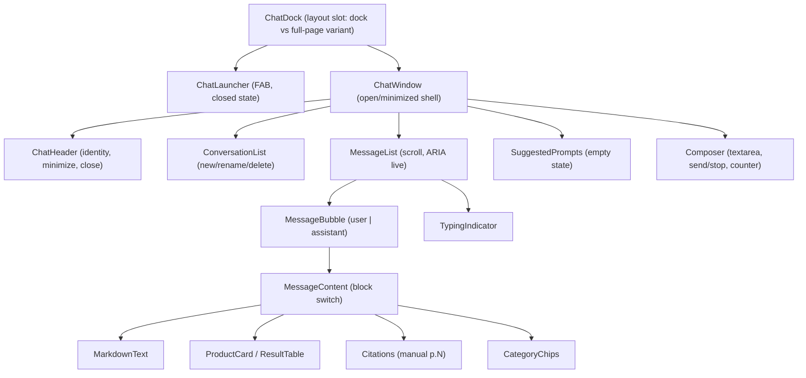
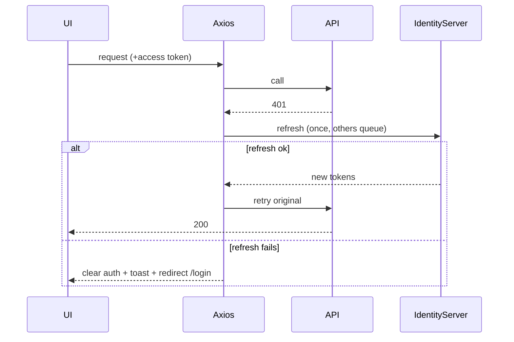

# Frontend Design — Archer Chatbot (React)

> **Status:** Phases 0–3 **implemented**. Phase 3 built the Section D backend (`/api/chat` SSE +
> `/api/conversations` CRUD + conversation persistence), migrated the frontend from client-side
> history to TanStack Query server state, and added the product/table/category business-data cards.
> Verified end-to-end against a running Aspire stack. Phase 4 planned.
> **Date:** 2026-09-20
> **Scope:** React 19 + Vite frontend for an e-shop business chatbot that answers (1) general
> questions via the LLM and (2) business-data questions from the seeded e-shop data.

---

## Step 1 — Inputs I read before designing

### 1a. Seed data (`seeddata/dev/*.json`)

All files are **arrays of records**. Every entity carries a pre-computed embedding field, which
tells us the backend does semantic search server-side — the frontend never touches embeddings.

| File | Count | Record shape (fields) | Notes / relationships |
| --- | --- | --- | --- |
| `categories.json` | 67 | `CategoryId`, `Name`, `NameEmbeddingBase64` | Product taxonomy. `Name` e.g. *Solar Power, Action Cameras, Hydration Systems, GPS Navigation*. Outdoor/adventure retail domain. |
| `products.json` | 200 | `ProductId`, `CategoryId → categories`, `Brand`, `Model`, `Description`, `Price`, `NameEmbedding` | 140 brands, price **14.99 – 5999.99**. Display name pattern is **`"Model (Brand)"`** (matches `CreateTicketRequest.productName`). |
| `customers.json` | 383 | `CustomerId`, `FullName` | Minimal — just identity. No email/address in seed. |
| `tickets.json` | 500 | `TicketId`, `ProductId → products`, `CustomerId → customers`, `CreatedAt`, `ShortSummary`, `LongSummary`, `CustomerSatisfaction` (1–10, **nullable**), `TicketStatus` (`Open`/`Closed`), `TicketType` (`Question`/`Idea`/`Complaint`/`Returns`), `Messages[]` | Support tickets. |
| ↳ `Messages[]` item | — | `MessageId`, `CreatedAt`, `TicketId`, `IsCustomerMessage` (bool), `Text` | Threaded conversation between a customer and staff. |
| `manual-chunks.json` | ~15 MB | `ChunkId`, `ProductId → products`, `PageNumber`, `Text`, `Embedding` | Product-manual text, pre-chunked + embedded. This is the **RAG knowledge base** the assistant searches. |

**Entity relationship (seed data):**



**Key implication for the chatbot:** "business data" = **products** (catalog/search), **categories**,
and **product manuals** (RAG). Tickets/customers are staff-side support data. The bot's business
answers will mostly be *product discovery* + *manual/how-to* questions.

### 1b. Backend API (`docs/postman/API.md`)

- **Auth:** all endpoints protected by JWT from a separate **IdentityServer**. Two policies:
  - `StaffApi` (default fallback) — JWT with `role=staff`. Covers `/tickets*`, `/api/ticket*`,
    `/api/assistant/*`, `/manual`, `/api/categories`, `/api/products`.
  - `CustomerApi` — any authenticated non-staff user with numeric `sub` = customer id. Covers
    `/customer/*`, `/api/customer/*`.
- **Token acquisition:** staff via **client-credentials** (`dev-and-test-tools`); customer via
  interactive **OIDC auth-code** (`customer-webui`, e.g. alice `sub=10000`).
- **Enums serialize as integers**: `TicketStatus {Open=0,Closed=1}`, `TicketType
  {Question=0,Idea=1,Complaint=2,Returns=3}`.

| # | Method | Path | Policy | Body | Response (shape) |
| --- | --- | --- | --- | --- | --- |
| 1 | POST | `/tickets` | Staff | `ListTicketsRequest` | `{ items[], totalCount, totalOpenCount, totalClosedCount }` |
| 2 | GET | `/tickets/{id}` | Staff | – | Ticket detail incl. `messages[]` (404 if missing) |
| 3 | PUT | `/api/ticket/{id}` | Staff | `UpdateTicketDetailsRequest` | 200; publishes Redis `ticket:{id}` event |
| 4 | POST | `/api/ticket/{id}/message` | Staff | `SendTicketMessageRequest` | 200; appends staff reply |
| 5 | POST | `/api/assistant/chat` | Staff | `AssistantChatRequest` | **Streaming** NDJSON-ish array (see below) |
| 6 | GET | `/manual?file={name}` | Staff | – | PDF bytes (404 if missing) |
| 7 | GET | `/api/categories?searchText=` or `?ids=1,2` | Staff | – | `[{ categoryId, name }]` |
| 8 | GET | `/api/products?searchText=` | Staff | – | `[{ productId, brand, model }]` |
| 9 | GET | `/customer/tickets` | Customer | – | Caller's own tickets |
| 10 | GET | `/customer/tickets/{id}` | Customer | – | One own ticket (404 if not theirs) |
| 11 | POST | `/customer/tickets/create` | Customer | `CreateTicketRequest` | Opens ticket; type auto-classified by Python model |
| 12 | POST | `/api/customer/ticket/{id}/message` | Customer | `SendTicketMessageRequest` | 200 |
| 13 | PUT | `/api/customer/ticket/{id}/close` | Customer | – | 200 |
| 14 | GET | `/api/customer/products?searchText=` | Customer | – | Storefront product search |

**Assistant streaming format (endpoint #5):** opens with `[null`, then appends `,\n<item>`
chunks, closes with `]`. Each `<item>` is an `AssistantChatReplyItem` with a `type`:
`AnswerChunk=0`, `Search=1`, `SearchResult=2`, `IsAddressedToCustomer=3`. It is **not valid JSON
until the final `]`** — must be parsed incrementally. Requires Ollama running + seeded manuals.

> ⚠️ **Critical finding:** `/api/assistant/chat` is the *only* AI endpoint, and it is a
> **staff-facing, ticket-scoped co-pilot** — its request requires `productId`, `customerName`,
> `ticketSummary`, and `ticketLastCustomerMessage`. There is **no general-purpose, customer-facing
> conversational chatbot endpoint**, and **no conversation persistence** of any kind. This is the
> central gap driving Section D.

### 1c. UI reference image

Carried-over layout elements from the attached dashboard mock:

- **Dark left icon rail** — workspace/bot switcher (stacked avatars + "＋ add").
- **Light secondary sidebar** — primary nav (Overview, Chat history, Leads, Links, Text, Q&A,
  Tune AI, Appearance, Deploy, Integrations, Settings) + a plan/upsell card pinned bottom.
- **Central content grid** — stat cards (Training usage, Messages, Leads chart, geo map).
- **Right-docked chat panel** — **the chatbot**: dark header with bot identity + close (✕),
  alternating **assistant (left, light) / user (right, dark)** bubbles, a **typing indicator**
  (three dots), a date/time separator chip, and a rounded **input with a send button**.

The image frames the chatbot as a **docked side panel** with clear bubble styling, a typing state,
and a persistent composer — this drives the entry-point recommendation in Section B.

---

## Step 2 — Design

## A. E-shop shell (frame only)

The shell is intentionally thin — this project's focus is the chatbot. Storefront/catalog pages
are placeholders.

```
┌───────────────────────────────────────────────────────────────┐
│ Header: logo · global search · cart · account menu · [Chat ◗]  │
├──────────┬────────────────────────────────────────────────────┤
│ Sidebar  │  Main content (routed <Outlet/>)                    │
│ (nav /   │                                                     │
│ catalog  │                                                     │
│ filters) │                        ┌───────────────────────────┐│
│          │                        │  Chatbot panel (docked,   ││
│          │                        │  overlays right edge;     ││
│          │                        │  floating launcher when   ││
│          │                        │  closed)                  ││
└──────────┴────────────────────────┴───────────────────────────┘
```

- **Header** — brand, product search, cart, account/auth menu, and the **chat launcher toggle**.
- **Sidebar** — catalog nav placeholder (categories from `/api/categories`).
- **Main** — routed pages via a single `<Outlet/>`.
- **Chatbot** — lives in a **persistent layout slot** (rendered once at the layout level so it
  survives route changes and keeps its open/minimized state).

### Route map (React Router v7)

| Route | Access | Purpose |
| --- | --- | --- |
| `/` | Public | Home / storefront landing (placeholder) |
| `/products` | Public | Catalog list (placeholder, backed by product search) |
| `/products/:productId` | Public | Product detail (placeholder) |
| `/login` | Public | Sign-in (redirect to IdentityServer / OIDC) |
| `/auth/callback` | Public | OIDC redirect handler |
| `/account` | **Auth** | Account overview (placeholder) |
| `/account/tickets` | **Auth (customer)** | Customer's own tickets (`/customer/tickets`) |
| `/account/tickets/:id` | **Auth (customer)** | Ticket thread |
| `/chat` | **Auth** | Full-page chat fallback (mobile / deep-link to a conversation) |
| `/staff` | **Auth (staff)** | Staff console shell (placeholder) |
| `*` | Public | 404 |

- **Public:** `/`, `/products*`, `/login`, `/auth/callback`, `404`.
- **Authenticated:** everything else, gated by a `<ProtectedRoute>` wrapper reading auth state
  from Zustand; **role-aware** (`customer` vs `staff`) for `/account/*` vs `/staff/*`.



---

## B. Chatbot window — **primary focus**

### B1. Entry point — recommendation

**Recommended: a right-docked collapsible side panel with a floating launcher button (FAB), plus a
full-page `/chat` route as the mobile/expanded fallback.**

Reasoning:
- The **reference image shows exactly this** — a chat panel docked to the right edge with a bot
  header and close button, sitting alongside dashboard content. It is not a full page and not a
  tiny bubble-only popover.
- A **docked panel** lets the user keep browsing the catalog while chatting (business-data queries
  like "show me waterproof jackets" pair naturally with the storefront behind it).
- A **FAB** is the lowest-friction closed state and is the industry-standard affordance.
- **Full-page `/chat`** covers mobile (where a side panel is impractical) and deep links to a
  specific conversation. One shared component tree renders in both a `Sheet` (desktop dock) and a
  full-height page (mobile) — driven by a `variant` prop, not duplicated.

Rejected alternatives: *full page only* (loses "chat while shopping"); *bubble popover only* (too
small for product cards/tables); *modal dialog* (blocks the page, fights the "browse + chat" flow).

### B2. States



| State | UI |
| --- | --- |
| **Closed** | FAB only (bot avatar, unread dot). |
| **Open** | Header (bot identity, minimize, close) + message list + composer. |
| **Minimized** | Collapsed header bar; click to restore; preserves scroll + draft. |
| **Empty / Welcome** | Greeting ("Hi! I'm the AI bot…") + **suggested prompts** (B4). |
| **Loading / typing** | Three-dot typing indicator bubble (as in image) while awaiting first token. |
| **Streaming** | Assistant bubble grows token-by-token; **Send** becomes **Stop**; auto-scroll unless user scrolled up. |
| **Error** | Inline error bubble + **Retry**; Sonner toast for transient/network errors. |
| **Unauthenticated** | Composer disabled with a "Sign in to chat" CTA → `/login`; welcome text still visible. |

### B3. Message rendering

- **User bubble** — right-aligned, dark (per image), plain text (no markdown execution for user).
- **Assistant bubble** — left-aligned, light, **rendered markdown** (sanitized): headings, lists,
  links, inline code, tables.
- **Structured business-data results** — the key differentiator. The assistant reply can carry
  *typed payloads*; render them as **rich cards, not raw text**:

  | Payload kind | Rendered as | Source data |
  | --- | --- | --- |
  | Product match(es) | **Product card(s)** — brand, model, price, category, "View" link | products |
  | Product list / comparison | **Compact table** (Brand · Model · Price) | products |
  | Manual / how-to answer | Markdown answer + **"From the manual (p.N)" citation chips** | manual-chunks |
  | Category suggestions | **Chips** that re-query on click | categories |
  | Ticket/order summary (staff) | **Summary card** (status, type, satisfaction) | tickets |
  | Plain LLM answer | Markdown text bubble | LLM |

- **Rendering strategy:** each assistant message is a list of **content blocks** discriminated by
  `kind` (`"text" | "products" | "table" | "citations" | "categories" | "ticket"`). A
  `<MessageContent>` switch maps block → component. A plain LLM answer is just a single `text`
  block, so general vs. business answers share one pipeline.
- **Streaming mapping:** the backend's `AssistantChatReplyItem` types map to blocks:
  `AnswerChunk` → append to current `text` block; `Search` → transient "Searching…" affordance;
  `SearchResult` → a `products`/`citations` block; `IsAddressedToCustomer` → metadata flag
  (staff co-pilot only). *(Section D proposes a cleaner customer-facing contract.)*

### B4. Suggested prompts / quick actions (seed-data driven)

Derived from the outdoor-retail seed so they actually return results:
- *"What solar power products do you have under $200?"* (products + price filter)
- *"Compare your GPS trackers."* (product table)
- *"How do I clean my waterproof jacket?"* (manual RAG)
- *"Recommend a hydration system for a day hike."* (category → products)
- *"What's your return policy?"* (general LLM)

Rendered as chips in the Welcome state and as a collapsible "＋" menu in the composer.

### B5. Conversation history

Mirrors the image's **"Chat history"** nav item.
- **New chat** — clears active thread, returns to Welcome.
- **List of past chats** — title (auto from first message), last-message preview, timestamp.
- **Rename / delete** — per-item overflow menu (Radix dropdown), delete confirmed via `AlertDialog`.
- **Persistence caveat:** the backend has **no conversation store today** (Section D). Until those
  endpoints exist, Phase 1 keeps history **client-side** (Zustand-persisted) as a documented
  interim, swapped for server-backed history in Phase 3.

### B6. Input / composer

- **Multiline** auto-grow textarea; **Enter** = send, **Shift+Enter** = newline.
- **Send / Stop** toggle — Stop aborts the in-flight stream (AbortController).
- **Character limit** — soft counter (e.g. 2000) with a color warning nearing the cap; block send
  when over.
- **Disabled states** — while streaming (except Stop), when unauthenticated, when offline.
- **Draft preservation** across minimize/route changes (Zustand UI state).

### B7. Responsive & accessibility

- **Desktop (≥1024px):** docked `Sheet`/side panel (~420px), overlays right edge.
- **Tablet:** narrower dock or slide-over.
- **Mobile (<768px):** FAB opens the **full-page `/chat`** route (full-height, no dock).
- **Accessibility:**
  - Keyboard: FAB and composer fully reachable; **focus moves into the panel on open** and
    **returns to the FAB on close** (focus trap while open).
  - **ARIA live region** (`aria-live="polite"`) wrapping the message list so new/streamed
    assistant text is announced without stealing focus.
  - Roles/labels on send/stop/minimize/close; visible focus rings; respects
    `prefers-reduced-motion` for the typing animation; contrast-checked bubbles.

---

## C. Frontend architecture

### C1. Folder structure (feature-based)

```
src/
├─ app/                      # app bootstrap
│  ├─ router.tsx             # React Router v7 route tree
│  ├─ providers.tsx         # QueryClient, Tooltip, Sonner <Toaster/>
│  └─ query-client.ts
├─ components/ui/            # shadcn/ui primitives (button, sheet, dialog, ...)
├─ lib/
│  ├─ axios.ts              # axios instance + interceptors
│  ├─ sse.ts                # streaming reader (fetch + ReadableStream)
│  └─ utils.ts
├─ features/
│  ├─ auth/                 # login, OIDC callback, ProtectedRoute, useAuth
│  ├─ chat/                 # ⭐ the chatbot
│  │  ├─ components/        # ChatDock, ChatWindow, MessageList, MessageBubble,
│  │  │                     # MessageContent, ProductCard, ResultTable, Citations,
│  │  │                     # Composer, SuggestedPrompts, TypingIndicator,
│  │  │                     # ConversationList, ChatLauncher
│  │  ├─ hooks/             # useConversations, useMessages, useSendMessage,
│  │  │                     # useChatStream
│  │  ├─ api/               # chat API fns (typed)
│  │  ├─ store/             # chat UI store (zustand)
│  │  └─ schemas/           # zod schemas for chat DTOs
│  ├─ catalog/              # product/category placeholders
│  └─ tickets/              # customer ticket views
├─ stores/                  # cross-feature zustand (auth, ui)
├─ schemas/                 # shared zod schemas
└─ types/                   # shared TS types
```

### C2. Chatbot component tree



| Component | Responsibility |
| --- | --- |
| `ChatDock` | Chooses dock (Sheet) vs full-page by breakpoint; owns open/minimized via store. |
| `ChatLauncher` | FAB + unread indicator. |
| `ChatWindow` | Layout shell; wires header/list/composer; focus management. |
| `ChatHeader` | Bot identity, minimize, close. |
| `ConversationList` | List/select/new/rename/delete conversations. |
| `MessageList` | Virtualizable scroll, auto-scroll, ARIA live region. |
| `MessageBubble` | Alignment/styling by role; timestamp. |
| `MessageContent` | Discriminated-union block renderer (text/products/table/citations/categories). |
| `ProductCard`/`ResultTable`/`Citations`/`CategoryChips` | Structured business-data renderers. |
| `TypingIndicator` | Three-dot loading (matches image). |
| `SuggestedPrompts` | Seed-driven quick actions. |
| `Composer` | Input, send/stop, counter, disabled states, draft. |

### C3. State split

| Concern | Tool | Notes |
| --- | --- | --- |
| Conversations list, messages, product/category search | **TanStack Query** | Server state; caching, retries, pagination, invalidation. |
| Streaming assistant response | TanStack Query mutation **+** manual stream store | Mutation kicks off; tokens appended to a query-cache entry or local buffer (C5). |
| Auth tokens (access/refresh), current user + role | **Zustand (persisted)** | Persisted to storage; hydrated on load; single source for interceptors + guards. |
| UI: panel open/minimized, active conversation id, draft, variant | **Zustand (persisted for UI prefs)** | Draft + open state survive route changes/minimize. |
| Forms (composer, any settings) | **React Hook Form + Zod** | `zodResolver`. |

> **Security note:** persisting refresh tokens in `localStorage` is XSS-exposed. Flag as an **Open
> Question** — prefer httpOnly refresh cookie from IdentityServer if the flow allows; otherwise
> persist access token in memory + refresh via cookie. Documented, not silently chosen.

### C4. Axios setup (JWT + auto-refresh)

- **Instance** with `baseURL` (resolved from env / Aspire), `withCredentials` if cookie-refresh.
- **Request interceptor:** attach `Authorization: Bearer <accessToken>` from the auth store
  (skip for public + IdentityServer token calls).
- **Response interceptor:** on **401**, attempt a **single refresh**, queue concurrent 401s behind
  one in-flight refresh (shared promise), then replay. On refresh success → retry original.
- **Refresh fails mid-chat:** abort any active stream, clear auth store, show a Sonner error
  ("Session expired — please sign in"), and **redirect to `/login` preserving `returnTo`**. The
  chat panel drops to the **Unauthenticated** state with the draft preserved so the user can resume
  after re-login.



### C5. Streaming consumption

- **Transport:** the assistant endpoint streams a **custom chunked array over HTTP** (not true
  SSE), so use the **`fetch` + `ReadableStream` reader** (with `AbortController` for Stop/refresh),
  **not** `EventSource` (can't send auth headers / POST body) and **not** axios (no stream reader in
  browsers). A small `lib/sse.ts` incrementally parses the `[null ,item ,item ]` framing into typed
  `AssistantChatReplyItem`s.
- **Fit with TanStack Query:**
  - `useSendMessage` is a **mutation** that (a) optimistically appends the user message, (b) opens
    the stream, (c) appends parsed chunks to the active conversation's message in the query cache
    (or a local buffer surfaced by `useChatStream`), (d) on `[DONE]` writes the final message and
    **invalidates** the conversation/messages queries.
  - Conversation list & history stay pure Query reads.
- **Interim (Phase 1)** until a customer endpoint exists: proposed `POST /api/chat` returning
  **SSE** (Section D) — cleaner than the current bespoke framing; the reader abstraction hides which
  one is in use.

### C6. Zod schemas

- **API responses (validate at the boundary):** `Product`, `Category`, `TicketSummary`, `Ticket`,
  `Message`, `TokenResponse`, and — once defined — `Conversation`, `ChatMessage`, and the
  **discriminated union** `AssistantContentBlock` (`text | products | table | citations |
  categories`).
- **Streaming items:** `AssistantChatReplyItem` (discriminated by numeric `type`).
- **Forms:** `composerSchema` (non-empty, ≤ max chars), `renameConversationSchema`,
  `createTicketSchema` (`productName` matching `"Model (Brand)"`, message length).
- **Enum coercion:** map integer enums → string literals (`TicketStatus`, `TicketType`) in the
  schema transform so the UI works with readable values.

### C7. Error handling & Sonner

| Situation | Handling |
| --- | --- |
| Validation (form/response parse) | Inline field errors (RHF) + a dev-time console for schema mismatches. |
| 401 → refresh fail | Toast + redirect (C4). |
| 403 (wrong role) | Toast "You don't have access", no redirect loop. |
| 404 (ticket/product) | Inline empty/not-found state. |
| 429 / 5xx | Toast with retry; exponential backoff on idempotent GETs via Query. |
| Stream broken | Inline error bubble + Retry; toast if network-level. |
| Offline | Global banner + disabled composer. |

Sonner `<Toaster/>` mounted once in `providers.tsx`; a thin `notify` helper standardizes
success/error/info variants.

---

## D. Backend gap analysis

The UI needs a **customer-facing, persistent, general+business conversational** API. The backend
currently offers only a **staff, ticket-scoped, stateless** assistant. Gaps are significant.

| Needed capability | Existing endpoint | Status | Proposed endpoint + shape |
| --- | --- | --- | --- |
| Send chat message (general + business) | `POST /api/assistant/chat` (staff, ticket-scoped, needs productId/customerName/summary) | **Partial** | `POST /api/chat` → `{ conversationId?, message }`; returns `{ conversationId, messageId }` then streams (below). Customer-authable. |
| Streaming responses | `/api/assistant/chat` custom `[null,…]` framing | **Partial** | Standardize on **SSE** `text/event-stream`: events `token`, `block` (structured product/citation payload), `done`, `error`. |
| Create conversation | — | **Missing** | `POST /api/conversations` → `{ id, title, createdAt }` (or implicit-create on first message). |
| List conversations | — | **Missing** | `GET /api/conversations?cursor=&limit=` → `{ items:[{id,title,updatedAt,preview}], nextCursor }`. |
| Get conversation + messages | — | **Missing** | `GET /api/conversations/{id}` → `{ id, title, messages:[{id,role,blocks[],createdAt}] }`. |
| Rename conversation | — | **Missing** | `PATCH /api/conversations/{id}` `{ title }`. |
| Delete conversation | — | **Missing** | `DELETE /api/conversations/{id}` → 204. |
| Message history pagination | — | **Missing** | `GET /api/conversations/{id}/messages?cursor=&limit=` (cursor-based). |
| Cancel generation | HTTP abort only (no server ack) | **Partial** | Client `AbortController` (works now); optional `POST /api/chat/{messageId}/cancel` for server-side stop + token accounting. |
| Suggested prompts | — | **Missing** | `GET /api/chat/suggestions` → `[{ id, label, prompt }]` (seed/catalog-derived); or hardcode client-side interim. |
| Feedback (👍/👎) | — | **Missing** | `POST /api/messages/{id}/feedback` `{ rating: 1 \| -1, reason? }` → 204. |
| Auth refresh | IdentityServer token/refresh | **Exists** | Reuse OIDC refresh; confirm refresh-token/cookie strategy (C3 note). |
| Product search (business data) | `GET /api/products` (staff), `GET /api/customer/products` (customer) | **Exists** | Use **customer** variant for storefront chat; ensure it returns price/category for cards. |
| Category search | `GET /api/categories` (staff only) | **Partial** | Add a **customer-accessible** category read, or expand `/api/customer/products` filters. |
| Manual/RAG citations | manual-chunks searched *inside* assistant | **Partial** | Surface citations in the SSE `block` payload `{ productId, page, snippet }` so the UI can render chips. |
| Intent routing (general vs business) | Python model classifies **ticket type**, not chat intent; assistant does internal Search | **Partial/unclear** | Decide **server-side** intent+RAG orchestration inside `POST /api/chat`; frontend stays intent-agnostic and just renders returned blocks. |

**Summary:** to ship the chatbot as shown, the backend needs a **new customer-facing `/api/chat`
family** (send + SSE stream), **conversation persistence** (CRUD + pagination), and small additions
(suggestions, feedback, customer category access, citation payloads). The frontend is designed to
degrade gracefully (client-side history + hardcoded suggestions) until these land.

---

## E. Authentication — backend reality & chosen approach

Investigated before planning Phase 1 (files: `src/IdentityServer/Config.cs`,
`HostingExtensions.cs`, `Pages/TestUsers.cs`, `Pages/Account/**`, and `src/Backend/Program.cs`).

### E1. What the backend actually supports

- **Backend trusts IdentityServer.** `src/Backend/Program.cs` wires `AddJwtBearer` with
  `Authority = IdentityUrl` and `ValidateAudience = false`. So **any JWT issued by IdentityServer is
  accepted**; authorization is by claim: `role=staff` → `StaffApi` (the fallback/default policy),
  authenticated-without-staff → `CustomerApi`. `sub` is preserved (the inbound `sub` map is removed).
- **IdentityServer grants (`Config.cs`):** only `client_credentials` (`dev-and-test-tools`, carries
  `role=staff`, headless) and `authorization_code` (`customer-webui`, `staff-webui`, each with a
  client secret + `/signin-oidc` redirect — i.e. **classic server-side web-app clients, not SPA/PKCE
  clients**). **There is no password/ROPC grant client, and no SPA client, today.**
- **Login & registration are IdentityServer's own Razor pages** (`Pages/Account/Login`,
  `Pages/Account/Create`) backed by an **in-memory `TestUserStore`** that is only registered
  `#if DEBUG` (`AddTestUsers`). Seeded users: **alice/alice** (`sub=10000`, customer) and **bob/bob**
  (`sub=10001`, `role=staff`). `Create` calls `TestUserStore.CreateUser` — in-memory, **not
  persisted**, no JSON endpoint.
- **No credential JSON API exists.** Unlike the CalConnect reference (`/users/login`,
  `/users/register`, `/users/refresh-token`, email verification via Papercut), archer has **none of
  these**. CalConnect's *UI patterns* transfer; its *transport contract* does not.

### E2. Decision

Use **IdentityServer's own hosted Login/Create (register) pages** via the standard OIDC
authorization-code + PKCE redirect. **No custom shadcn auth forms in the SPA.** This is the
spec-correct, production-grade path and matches how the existing `customer-webui`/`staff-webui`
clients are meant to work. CalConnect's credential-form patterns are therefore **not** used for
auth (they remain a reference only for the non-auth UI conventions).

### E3. Approaches considered

| Approach | Auth UI | Backend change | Notes |
| --- | --- | --- | --- |
| **A. OIDC auth-code + PKCE redirect** ✅ *chosen* | IdentityServer's hosted pages (no in-app forms) | Add one **public SPA client** (PKCE) to `Config.cs` | Spec-correct, production-grade; sign-up = IdentityServer's `Create` page; uses an OIDC client lib. |
| B. ROPC password grant + custom shadcn forms | In-app forms | Dev ROPC client + dev register endpoint | Rejected: ROPC is deprecated; keeps forms in-app but non-standard. |
| C. New first-class auth API in Backend issuing its own JWTs | In-app forms | Large (own signing keys / 2nd issuer, user DB) | Overkill; rejected. |

### E4. Chosen approach — **A (OIDC auth-code + PKCE redirect)**

Rationale: standard, secure, and IdentityServer already owns login/registration. The SPA never sees
credentials; it redirects to IdentityServer, which authenticates (and, via its `Create` page,
registers) the user and redirects back with an authorization code the SPA exchanges for tokens using
PKCE. Tokens are IdentityServer-issued, so **the Backend needs no auth changes**.

Required backend edit (Phase 1.1) — add one **public SPA client** to `src/IdentityServer/Config.cs`:
```
ClientId = "webui",
AllowedGrantTypes = GrantTypes.Code,
RequireClientSecret = false,          // public client
RequirePkce = true,                   // PKCE (default for code flow)
RedirectUris          = { "http://localhost:5173/auth/callback" },
PostLogoutRedirectUris= { "http://localhost:5173/" },
AllowedCorsOrigins    = { "http://localhost:5173" },   // browser calls /connect/token + discovery
AllowOfflineAccess    = true,                          // refresh tokens (rotated) for the SPA
AllowedScopes = { openid, profile, "role", "staff-api", offline_access },
```
No registration endpoint is needed — the **`Create` page** linked from IdentityServer's Login page
handles sign-up (in-memory `TestUserStore`, DEBUG). Sign-up is thus an IdentityServer concern, not
the SPA's.

**Token flow the SPA will use (via `oidc-client-ts`):**
- **Sign in** → `userManager.signinRedirect()` → IdentityServer Login page → back to
  `/auth/callback` → `signinRedirectCallback()` exchanges the code (PKCE) for tokens.
- **Sign up** → same redirect; the user clicks "create an account" on IdentityServer's page.
- **Refresh** → `oidc-client-ts` silent/automatic renew using the rotated refresh token.
- **Sign out** → `userManager.signoutRedirect()` (ends the IdentityServer session too).
- **User identity/role** → from the OIDC `profile`/access-token claims (`name`, `sub`, `role`);
  mirrored into a thin `stores/auth.ts` for UI + route guards. **`oidc-client-ts` owns token
  storage** (we no longer persist tokens by hand).

**Security note:** PKCE public client with rotated refresh tokens is the recommended SPA pattern.
Refresh tokens still live in browser storage managed by the library; acceptable for this exercise.

> **Chat-policy consequence:** the only AI endpoint, `POST /api/assistant/chat`, is under the
> **`StaffApi`** policy (needs `role=staff`) and is **ticket-shaped**. So in Phase 1, streaming chat
> only works when signed in as a **staff** user (bob), and the SPA sends an adapter-built
> `AssistantChatRequest`. A customer-facing `/api/chat` is the Section D / Phase 3 gap. Requesting
> the `staff-api` scope means staff logins carry `role` and the endpoint works; customer logins can
> still use the app but the live assistant stream is staff-gated until Section D lands.

---

## Open Questions

1. **Who is the chatbot for?** *Decision (this iteration): one unified app, staff/customer not
   distinguished.* The only AI endpoint is staff-gated, so live chat in Phase 1 requires a staff
   login (bob); a customer-facing endpoint remains the Section D / Phase 3 gap.
2. **Conversation persistence** — is there any store today, or is all history to be built new
   (Section D)? Interim client-side history acceptable?
3. **Streaming contract** — may we replace the bespoke `[null,…]` framing with **SSE**, or must the
   frontend consume the existing format for now?
4. **Intent routing** — ✅ **Decided: server-side.** "General vs business data" is decided by the
   backend's assistant orchestration; the frontend stays **intent-agnostic** and just renders the
   blocks/reply-items returned. No client-side intent hinting.
5. **Structured payloads** — ✅ **Decided: typed blocks.** The backend returns **typed payloads**
   (product / citation), not markdown the frontend must parse. Phase 2 maps the existing
   `SearchResult` reply-items (`SearchResultProductId`, `SearchResultPageNumber`) into typed
   `products`/`citations` blocks; the Section D `/api/chat` SSE `block` events formalize this.
6. **Customer catalog access** — categories are staff-only; confirm a customer-safe category/product
   read for chat cards.
7. **Token storage** — `oidc-client-ts` manages tokens in browser storage (rotated refresh tokens).
   For a hardened deploy, consider the BFF pattern (httpOnly cookie); acceptable as-is for this
   exercise.
8. **Redirect/CORS registration** — confirm the SPA origin/redirect (`http://localhost:5173`,
   `/auth/callback`) is acceptable to add to IdentityServer, and adjust if the SPA is served on a
   different host/port (e.g. via Aspire).
9. **Manuals** — `/manual` returns **PDF** (staff). Does chat cite PDF pages, or only manual-chunk
   text snippets?
10. **Product images** — none in seed data. Product cards will be text-only unless an image
    source is added.

---

## Phased implementation plan

**Phase 0 — Scaffolding — ✅ DONE (`src/WebUI`)**
Vite + React 19 + TS; Tailwind v4 (`@tailwindcss/vite`); shadcn/ui init; React Router v7 shell
(layout + public/protected routes); TanStack Query + Zustand providers; Axios instance (with a
*provisional* refresh interceptor); Sonner; Zod base schemas; chat dock shell. No chat/auth logic.

---

### Phase 1 — Auth + Chatbot MVP (client-orchestrated) — ✅ DONE & verified

**Completion analysis (against shipped `src/WebUI`):** all six sub-steps below are implemented and
the app builds/lints clean. Cross-checked to real files:

| Sub-step | Delivered | Key files (verified present) |
| --- | --- | --- |
| 1.0 deps/primitives | ✅ | `oidc-client-ts`, `react-markdown`+`remark-gfm`; `components/ui/{textarea,dropdown-menu,avatar,button,card,sonner}.tsx` |
| 1.1 backend auth | ✅ | public `webui` PKCE client in `src/IdentityServer/Config.cs` |
| 1.2 auth feature | ✅ | `features/auth/{oidc.ts,useAuth.ts,CallbackPage.tsx,ProtectedRoute.tsx}`, `stores/auth.ts`, `lib/axios.ts` (silent-renew refresh), `pages/LoginPage.tsx` |
| 1.3 domain/state | ✅ | `features/chat/{types.ts,store.ts,constants.ts}` — `ChatMessage`/`Conversation`, Zustand-persisted history, seed prompts |
| 1.4 streaming transport | ✅ | `features/chat/{assistant-stream.ts,api.ts,useSendMessage.ts}` — bespoke `[null,…]` reader, `AssistantChatRequest` adapter, abortable mutation |
| 1.5 chat UI | ✅ | `features/chat/components/{ChatWindow,MessageList,MessageBubble,MessageContent,TypingIndicator,Composer,SuggestedPrompts,ConversationList}.tsx`, `ChatDock`, `/chat` page via `variant` |
| 1.6 verification | ✅ | build + lint clean; sign-in-as-staff → stream smoke path |

**Known Phase-1 scope limits (handled next in Phase 2):** `ContentBlock` is `text`-only
(`types.ts:10`); `useSendMessage` consumes only `AnswerChunk` and **drops** `Search` /
`SearchResult` items (`useSendMessage.ts:36-41`); `MessageContent` renders markdown only, no card
renderers; `schemas/catalog.ts` (`Product`/`Category`) exists but is not yet wired to any query.

<details><summary>Phase 1 sub-step detail (as built)</summary>

**Phase 1.0 — Shared deps & UI primitives**
- Add deps: `oidc-client-ts` (OIDC auth-code + PKCE), `react-hook-form`, `@hookform/resolvers`
  (composer/validation), `@radix-ui/react-dropdown-menu`, `@radix-ui/react-avatar`, and a small
  sanitized markdown renderer (`react-markdown` + `remark-gfm`).
- Add shadcn primitives actually used: `textarea`, `dropdown-menu`, `avatar` (copied 1:1 from the
  reference's `new-york` style). *No auth form primitives (input/label) needed — auth has no in-app
  forms.* No unused primitives.

**Phase 1.1 — Backend auth enablement** — *the only backend touch*
- `src/IdentityServer/Config.cs`: add the public **`webui` SPA client** (Section E4: code + PKCE,
  no secret, redirect `http://localhost:5173/auth/callback`, CORS origin, `offline_access`,
  scopes incl. `role`/`staff-api`). Verify the discovery doc, redirect, and refresh work for
  alice/bob. No registration endpoint (IdentityServer's `Create` page covers sign-up).

**Phase 1.2 — Auth feature (frontend)** `features/auth/`
- `oidc.ts`: a single `UserManager` (authority = IdentityServer, `client_id=webui`,
  `redirect_uri=/auth/callback`, `scope="openid profile role staff-api offline_access"`,
  `WebStorageStateStore`, automatic silent renew).
- `hooks.ts`: `useSignIn` (`signinRedirect`), `useSignOut` (`signoutRedirect`), and load/sync the
  current user; `CallbackPage` at `/auth/callback` runs `signinRedirectCallback()` then routes to
  `returnTo`.
- `stores/auth.ts`: becomes a **thin mirror** of the OIDC user (`isAuthenticated`, `id`, `name`,
  `role`), synced from `UserManager` events. `oidc-client-ts` owns tokens (drop hand-rolled token
  persistence).
- **Replace the provisional refresh** in `lib/axios.ts`: attach `getUser()?.access_token`; on 401
  try `signinSilent()` once and retry, else `signinRedirect()` (returnTo preserved).
- Remove the Phase 0 placeholder `LoginPage`; `/login` simply triggers `signinRedirect()` (or the
  header handles it directly). No `SignUpPage` (IdentityServer owns registration).
- Header: account menu (avatar + name + **Sign out**) when authed; **Sign in** button (→ redirect)
  otherwise.

**Phase 1.3 — Chat domain, state & schemas** `features/chat/`
- Zod/types: `ChatMessage` (`id, role, blocks[], createdAt, status`), `Conversation`
  (`id, title, messages[], createdAt, updatedAt`), and the `AssistantContentBlock` union (Phase 1
  ships `text`; product/table/citation blocks are Phase 2).
- `store/conversations.ts`: **Zustand-persisted** client-side history — new / list / get / select /
  rename / delete / append-message / patch-streaming-message. (Interim per Section D until server
  endpoints exist.)
- `constants.ts`: **seed-driven suggested prompts** (Section B4), hardcoded.

**Phase 1.4 — Streaming transport** `features/chat/`
- `lib/assistant-stream.ts`: `fetch` + `ReadableStream` reader that parses the bespoke
  `[null ,item ,item ]` framing (AssistantApi.cs) into typed `AssistantChatReplyItem`s
  (`AnswerChunk=0, Search=1, SearchResult=2, IsAddressedToCustomer=3`); `AbortController` for Stop;
  attaches the bearer token manually (fetch, not axios — axios can't stream in the browser).
- `api/chat.ts`: adapter mapping a conversation turn → the existing `AssistantChatRequest`
  (`productId`/`customerName`/`ticketSummary` optional/derived). Documented as the interim shim for
  the staff-gated endpoint (Section D / Open Q#1).
- `hooks/useSendMessage.ts`: mutation that optimistically appends the user message, opens the
  stream, appends `AnswerChunk`s to the assistant message in the conversation store, finalizes on
  `]`, and surfaces `Search`/`SearchResult` as a lightweight "searching…" affordance (full
  citation rendering is Phase 2).

**Phase 1.5 — Chat UI** `features/chat/components/`
- Real `ChatWindow` replacing the Phase 0 placeholder: `MessageList` (auto-scroll + `aria-live`
  region), `MessageBubble` (user vs assistant), `MessageContent` (markdown text block MVP),
  `TypingIndicator`, `Composer` (multiline auto-grow, Enter/Shift+Enter, **send/stop**, char
  counter, disabled states), `SuggestedPrompts` (welcome state), `ConversationList` (new/rename/
  delete). States: closed/open/minimized/welcome/typing/streaming/error/**unauthenticated** (composer
  disabled + "Sign in to chat" CTA).
- `ChatDock` renders the real window; full-page `/chat` reuses the same tree via a `variant` prop
  (mobile fallback per B7).

**Phase 1.6 — Verification**
- `npm run build` (tsc) + `npm run lint` clean; dev smoke test (sign in as bob → send a prompt →
  observe streamed answer; sign out; unauthenticated composer state). Backend/IdentityServer/Ollama
  running via Aspire. Keep code clean, no redundant primitives/exports.

</details>

---

### Phase 2 — Structured business data — ✅ DONE (scoped to backend reality)

**Backend finding that reshaped scope (verified in `Backend/Api/AssistantApi.cs` +
`CatalogApi.cs`):** the only assistant endpoint emits, as typed payloads, **manual citations
only** — the LLM writes inline `<cite searchResultId=N>quote</cite>` markup and the stream sends
`SearchResult` items carrying `{ searchResultId → productId, pageNumber }` with **empty text and no
product fields**. There is **no product-by-id endpoint** (`/api/products` only does semantic
`searchText`). So **ProductCard / ResultTable / CategoryChips have no data source today** and are
**deferred to Phase 3** (the Section D `/api/chat` typed `block` payloads). Building them now would
be dead code. Phase 2 therefore delivered the citation pipeline — the real typed payload — plus the
search affordance, a11y, and responsive polish. Server-side intent + typed blocks (Open Q#4/#5)
remain the contract; the frontend stays intent-agnostic and just renders returned reply-items.

**Phase 2.1 — Block model** `features/chat/types.ts` ✅
- `ContentBlock` union: `TextBlock`, `CitationsBlock` (`{ searchResultId, productId, page }[]`),
  transient `SearchingBlock` (`phrase`). Added `messageCitations()`; `messageText()` already
  ignores non-text blocks. (Product/table/category block types intentionally omitted — no emitter.)

**Phase 2.2 — Store operations** `features/chat/store.ts` ✅
- `addCitations` (single citations block, de-duped by `searchResultId`, fills missing
  productId/page), `setSearching(phrase|null)` (at most one transient block), and `setMessageStatus`
  strips the searching block on finalize. Fixed `deriveTitle` to use `messageText()` (the old
  `block.text` map would break on non-text blocks — the latent bug flagged last turn).

**Phase 2.3 — Stream reply-item mapping** `features/chat/useSendMessage.ts` ✅
- The previously-dropped items now map: `Search` → `setSearching(phrase)`; `SearchResult` →
  clears searching + `addCitations({ searchResultId, productId, page })`. `AnswerChunk` unchanged.

**Phase 2.4 — Citation correlation** `features/chat/cite.ts` ✅
- `parseAnswer(text, citations)` lifts `<cite …>` tags out of the markdown, numbers them by first
  appearance, joins each to its `SearchResult` (productId/page), and strips a half-written cite tag
  still streaming in. Returns clean markdown + ordered `CiteRef[]`.

**Phase 2.5 — Renderer** `features/chat/components/Citations.tsx` ✅
- Numbered "From the manual (p.N) — &ldquo;quote&rdquo;" chips under the answer. (ProductCard /
  ResultTable / CategoryChips deferred — see finding above.)

**Phase 2.6 — Wire into `MessageContent`** ✅
- Assistant path renders cleaned markdown → inline "Searching {phrase}…" affordance → `Citations`
  footer. `MessageBubble` now yields the typing dots as soon as a searching/citation block exists
  (so the search state surfaces before any answer text).

**Phase 2.7 — Accessibility** `useFocusTrap.ts` + `ChatDock.tsx` ✅
- Real focus trap: focus moves into the panel on open (container `tabIndex={-1}`), Tab cycles within
  it, **Escape closes**, and focus returns to the launcher afterward. `MessageList` keeps its
  `aria-live="polite"` region; `prefers-reduced-motion` honored on the typing dots and search spinner
  (`motion-reduce:animate-none`).

**Phase 2.8 — Responsive** ✅
- Existing `ChatDock` breakpoints confirmed: full-screen panel on mobile, ~26rem docked panel from
  `sm`; full-page `/chat` variant unchanged. No new layout needed for the citation footer.

**Phase 2.9 — Verification** ✅
- `npm run build` (tsc) + `npm run lint` clean (only a pre-existing shadcn `button.tsx` fast-refresh
  warning). Manual smoke test pending a running Aspire stack (sign in as bob → ask a manual
  question → observe "Searching…" then answer with numbered citation chips).

### Phase 3 — Server-backed conversations + business-data blocks (Section D — ✅ DONE & verified)

Phase 3 is the first **two-sided** phase: unlike Phases 0–2 (frontend-only, plus one small
`Config.cs` client edit), it required **new backend endpoints** — none of Section D existed before.
Delivered **Backend (3.1–3.5)** then **Frontend (3.6–3.11)**; verified end-to-end against a running
Aspire stack (conversation CRUD, chat SSE with product + citation blocks, persistence + multi-turn
context, delete-cascade, owner isolation).

**Completion analysis (against shipped code):**

| Sub-step | Delivered | Key files |
| --- | --- | --- |
| 3.1 persistence | ✅ | `Backend/Data/{Conversation,ConversationMessage}.cs`, `AppDbContext` (DbSets, cascade, `OwnerSub` index) |
| 3.4 block DTOs + card data | ✅ | `Backend/Api/ChatContracts.cs` (polymorphic `ChatBlock`: text/citations/products/categories); products enriched with price+category server-side in the chat tool |
| 3.2 conversation CRUD | ✅ | `Backend/Api/ConversationApi.cs` (list/get/create/rename/delete), new `AuthenticatedApi` policy, `sub`-scoped |
| 3.3 `/api/chat` SSE | ✅ | `Backend/Api/ChatApi.cs` — SSE `token`/`search`/`block`/`done`/`error`, manual+product+category tools, persists turn |
| 3.6 API + schemas + SSE reader | ✅ | `features/chat/{api.ts,schemas.ts,chat-stream.ts}` (zod boundary; SSE reader replaces `[null,…]`) |
| 3.7 server-state history | ✅ | `features/chat/{store.ts,useConversations.ts}` — ephemeral `activeId`; Query list/detail + optimistic rename/delete |
| 3.8 stream into cache | ✅ | `features/chat/{useSendMessage.ts,message-blocks.ts}` — SSE into query cache, invalidate on done |
| 3.9 business-data renderers | ✅ | `features/chat/components/{ProductCard,ResultTable,CategoryChips}.tsx`, wired into `MessageContent` |
| 3.11 verification | ✅ | backend `dotnet build` 0 errors; `npm run build`+`lint` clean; E2E smoke on Aspire |

**Deviations from the plan (with rationale):**
1. **Ollama endpoint fix (prerequisite).** Chat failed with `No such host is known (chatcompletion:80)`.
   Root cause: the CommunityToolkit Aspire Ollama resource exposes the server as a **connection string**
   (`ConnectionStrings__chatcompletion=Endpoint=http://host:port`), not a service-discovery endpoint, so
   `http://{serviceName}` never resolved. Fixed in `ServiceCollectionChatClientExtensions.cs` to read the
   endpoint from the connection string.
2. **No separate `/api/customer/products?ids=` or `/api/customer/categories` HTTP reads.** The plan listed
   them, but the chat `products`/`categories` blocks already carry the entity data (price, category name)
   enriched **server-side inside the chat tool** (`dbContext` join), and category chips re-query via a chat
   message. Adding the HTTP endpoints would be **dead code** (nothing consumes them) — the same "no dead
   code" principle Phase 2 used to defer the cards. `CatalogApi.SearchCategoriesCoreAsync` was extracted
   for reuse by the chat category tool.
3. **SSE `search` event** added alongside `token`/`block`/`done`/`error` to preserve Phase 2's transient
   "Searching…" affordance (client-only, never persisted).
4. **New conversations use explicit-create** (client `POST /api/conversations` then stream) to get a real
   id/cache key without temp-id juggling; the server still supports implicit-create on first message.
5. **Feedback / suggestions endpoint / server-side cancel** remain deferred to Phase 4 (as planned).

**Backend reality re-verified before planning (files checked):**

| Fact | Evidence | Consequence for Phase 3 |
| --- | --- | --- |
| No conversation store | `AppDbContext.cs` has only `Customers/Tickets/Messages/ProductCategories/Products` (no `Conversation`/`ChatMessage`) | Must add entities + persistence (3.1). |
| No customer chat endpoint | `Backend/Api/*` = `Assistant`, `Catalog`, `Ticket`, `TicketMessaging` only; `/api/assistant/chat` is `StaffApi`, ticket-shaped, bespoke `[null,…]` framing | Must add `POST /api/chat` (3.3). |
| No product-by-id / entity read | `CatalogApi.cs` `SearchProductsAsync` is `searchText`-only and returns `{productId, brand, model}` — no price/category | ProductCard/ResultTable still have no source until 3.4 adds one. |
| Categories are staff-only | `/api/categories` has no `/api/customer/*` variant; only `/api/customer/products` is under `CustomerApi` | Add a customer-safe category read (3.4). |

#### Endpoint decision — what to implement **in Phase 3** vs. defer

Re-scoping Section D against the goal (server-backed history + business-data cards), not every gap
is worth building now. Decisions:

| Section D capability | Phase 3? | Rationale |
| --- | --- | --- |
| `POST /api/chat` (customer-facing, general+business, **SSE**) | ✅ **Build** | The core gap; unblocks a non-staff, non-ticket chat + typed blocks. |
| Conversation CRUD (`POST`/`GET` list/`GET` one/`PATCH`/`DELETE`) | ✅ **Build** | Required to replace the interim Zustand history. |
| Message history read (per conversation) | ✅ **Build** | Folded into `GET /api/conversations/{id}`; add cursor pagination only if a thread grows large. |
| Product **entity** read for cards (`GET /api/customer/products?ids=` or enriched search) | ✅ **Build** | Without price/category there are no ProductCard/ResultTable — the headline Phase 3 UI. |
| Customer category read | ✅ **Build** | Needed for CategoryChips + business-data filtering; small addition. |
| Typed `block` payloads in the stream (products/citations/categories) | ✅ **Build** | The contract the frontend renderers consume. |
| Suggested-prompts endpoint | ⏭️ **Defer** | Client-side hardcoded prompts (`constants.ts`) already ship; move server-side only if they need to be catalog-derived. |
| Feedback 👍/👎 (`POST /api/messages/{id}/feedback`) | ⏭️ **Defer → Phase 4** | Not needed to render conversations/cards; additive later. |
| Server-side cancel (`POST /api/chat/{id}/cancel`) | ⏭️ **Defer → Phase 4** | Client `AbortController` already stops the stream; server ack is a hardening nicety. |

> **Net:** Phase 3 builds **one new endpoint family (`/api/chat` + `/api/conversations`)**, **one
> data-model addition (conversation persistence)**, and **two small catalog reads** (product-by-id,
> customer categories). Suggestions/feedback/server-cancel are explicitly **out**.

---

#### Backend (Section D implementation)

**Phase 3.1 — Conversation persistence (data model)** `Backend/Data/`
- New EF entities `Conversation` (`Id`, `OwnerSub`, `Title`, `CreatedAt`, `UpdatedAt`) and
  `ConversationMessage` (`Id`, `ConversationId`, `Role`, `BlocksJson`, `CreatedAt`) — store the typed
  block list as JSON so the persisted shape matches the streamed contract 1:1. Register `DbSet`s in
  `AppDbContext`; cascade-delete messages with their conversation (mirror the existing
  `Ticket ↦ Messages` mapping). `EnsureCreatedAsync` picks up the new tables (no migration tooling in
  play today).
- **Ownership:** every row is keyed by the caller's `sub`; all reads/writes filter on it so a user
  only ever sees their own conversations (staff `sub` and customer numeric `sub` both work).

**Phase 3.2 — Conversation CRUD API** `Backend/Api/ConversationApi.cs` (new)
- `POST /api/conversations` → `{ id, title, createdAt }` (or implicit-create on first `/api/chat`
  message — pick implicit-create to avoid an empty-conversation race).
- `GET /api/conversations?cursor=&limit=` → `{ items:[{ id, title, updatedAt, preview }], nextCursor }`
  (cursor = `updatedAt`+id, newest first).
- `GET /api/conversations/{id}` → `{ id, title, messages:[{ id, role, blocks[], createdAt }] }`.
- `PATCH /api/conversations/{id}` `{ title }` → 200; `DELETE /api/conversations/{id}` → 204.
- **Policy:** a new `AuthenticatedApi` (any authenticated user) rather than `StaffApi`/`CustomerApi`,
  since chat is for both roles; all handlers scope by `sub` (404 on cross-owner access, never 403-leak
  existence).

**Phase 3.3 — `POST /api/chat` (customer-facing conversational endpoint)** `Backend/Api/`
- Request `{ conversationId?, message }`; response **streams SSE** (`text/event-stream`) with events
  `token` (answer delta), `block` (typed structured payload), `done`, `error`. Implicit-creates the
  conversation when `conversationId` is absent and returns its id in the first `done`/header.
- **Server-side orchestration (Open Q#4, decided server-side):** reuse the existing tools —
  `ProductManualSemanticSearch` (RAG) and `ProductSemanticSearch` (catalog) — behind a system prompt
  that lets the model decide general-vs-business and emit tool calls. The frontend stays
  intent-agnostic. Not ticket-shaped: drop the `productId/customerName/ticketSummary` requirement that
  makes `/api/assistant/chat` staff-only.
- **Persistence:** on completion, save the user message and the assembled assistant `blocks[]` to the
  conversation (3.1) so history survives reload.

**Phase 3.4 — Typed block payloads + card data sources** `Backend/`
- Define the streamed/persisted block contract (shared DTO): `text`, `citations`
  (`{ searchResultId, productId, page, snippet }`), `products` (`{ productId, brand, model, price,
  categoryName }[]`), `categories` (`{ categoryId, name }[]`). Emitted as `block` SSE events.
- **Product entity read:** extend `CatalogApi` with `GET /api/customer/products?ids=1,2,3` (batch
  by id, returns price + categoryName) **or** enrich the existing search DTO — needed because the
  `products` block must carry price/category the current search omits.
- **Customer category read:** add `GET /api/customer/categories?searchText=|ids=` under `CustomerApi`
  (reuse `SearchCategoriesAsync`) so CategoryChips/business filters work for non-staff.

**Phase 3.5 — Auth, CORS & smoke** `IdentityServer` + `Backend`
- Confirm the `webui` SPA client scopes cover the new endpoints; add a `chat`/`conversations` scope
  only if we choose to gate by scope (otherwise `AuthenticatedApi` policy is enough). Verify CORS for
  the SSE endpoint (`http://localhost:5173`). Smoke: alice (customer) can chat + list her own
  conversations; bob (staff) sees only his.

#### Frontend

**Phase 3.6 — API client, schemas & SSE reader** `features/chat/`
- `api/conversations.ts`: typed CRUD fns. `schemas/`: zod `Conversation`, `ConversationSummary`,
  `ChatMessage`, and the discriminated-union `ContentBlock` (now incl. `products`/`categories`),
  validated at the boundary.
- Swap `assistant-stream.ts`'s bespoke `[null,…]` parser for an **SSE reader** (`fetch` +
  `ReadableStream`, still `AbortController`-driven) behind the same reader abstraction so callers are
  unaffected — `token`→text, `block`→typed block, `done`/`error` terminal.

**Phase 3.7 — Migrate history to server state (TanStack Query)** `features/chat/`
- Replace the Zustand-persisted `store.ts` history with Query: `useConversations` (list, cursor
  pagination), `useConversation(id)` (messages). Mutations `useCreate/useRename/useDelete` with
  **optimistic updates + invalidation** (design C3). Retire the `archer-chatbot-conversations`
  persisted store (keep only ephemeral UI state — open/minimized/draft — in Zustand). One-time:
  drop the localStorage key (no client→server migration needed for this exercise).

**Phase 3.8 — Streaming into server-backed messages** `features/chat/useSendMessage.ts`
- Mutation: optimistically append the user message, open the SSE stream, append `token`s and typed
  `block`s to the active conversation's assistant message in the **query cache**, and on `done`
  **invalidate** conversation + list queries (so title/preview/updatedAt refresh from the server).

**Phase 3.9 — Business-data block model + renderers** `features/chat/`
- `types.ts`: add `ProductsBlock`, `TableBlock` (a `products` render variant), `CategoriesBlock`
  (the types deliberately omitted in Phase 2 for lack of an emitter).
- Components: `ProductCard` (brand · model · price · category + "View" → `/products/:id`),
  `ResultTable` (compact Brand · Model · Price), `CategoryChips` (re-query on click). Wire into the
  `MessageContent` block switch alongside the existing text/citations renderers.

**Phase 3.10 — Server-side cancel (optional, may slip to Phase 4)**
- If `POST /api/chat/{id}/cancel` is added, call it on Stop for token accounting; otherwise the
  existing `AbortController` remains the mechanism.

**Phase 3.11 — Verification**
- `npm run build` + `npm run lint` clean; backend builds. E2E smoke on Aspire: alice asks a business
  question → product cards render; a manual question → citations; refresh → history reloads from
  server; rename/delete round-trip; new chat persists. Confirm staff/customer isolation.

---

**Phase 4 — Hardening**
Error/empty/offline states; retries/backoff; token-storage hardening; performance (message
virtualization, code-split chat feature); tests (schema, interceptor, stream parser, key flows);
analytics hooks if needed.

---

*End of plan. Phases 0–3 shipped and verified. Phase 3 implemented the Section D backend
(`/api/chat` SSE + `/api/conversations` CRUD + conversation persistence), migrated the frontend from
client-side history to TanStack Query server state, and added the product/table/category card blocks
— including a prerequisite fix so the backend resolves Ollama from its Aspire connection string.
Suggestions, feedback, and server-side cancel remain deferred to Phase 4.*
